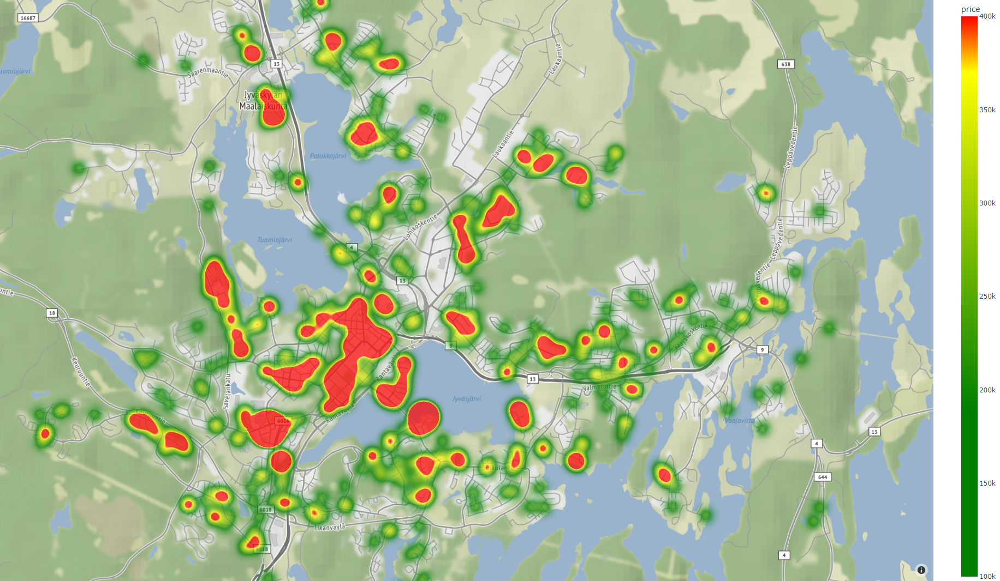

# Housing price heatmap creator
This program can visualise apartment prices from certain cities found on Oikotie. 

## How?
1. Generate an Api key on [Positionstack]( http://api.positionstack.com). After this create a .env file and add the api key as *API_KEY=''"*
2. First the program accesses Oikotie for the selected city with Selenium. The address of each apartment is converted to coordinates with [Positionstack Api.]( http://api.positionstack.com) This phase will take awhile due to added delay to avoid Api throttling. All apartments' prices and coordinates are added to .csv file. 
3. After all apartments have been processed the program will close. You can now launch *data_to_map.py* to visualise the apartment prices on an interactive map.

## Issues

 - Code is messy
 - Data_to_map range_color must be edited manually
 - Cities less than one page of apartments will crash

